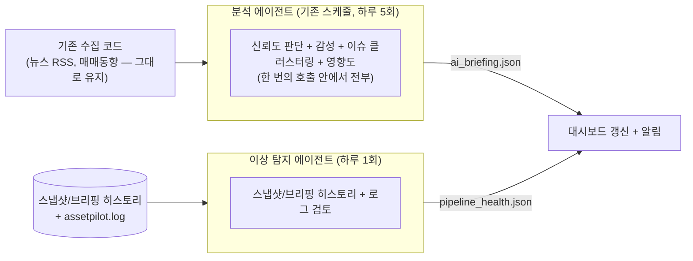

# AssetPilot 멀티 에이전트 파이프라인 설계 (초안)

> 상태: 설계 중. 아직 구현되지 않았다. 지금 실제로 도는 파이프라인은 [PIPELINE.md](PIPELINE.md) 참고.

## 배경 & 설계 변경 이력

처음엔 데이터 수집·검증 / 분석 / 이상 탐지 3개 에이전트로 나누려 했으나(08-19 초안), 재검토 후
**2개로 줄였다**:

- **수집·검증을 분석에 통합**한 이유: 분석 에이전트는 어차피 뉴스 원문을 전부 읽고 요약/감성/이슈를
  판단하므로, 그 과정에서 "이 기사는 출처가 불확실하니 덜 신뢰한다"까지 같은 호출 안에서 판단하면
  된다 — 사람 애널리스트도 기사 신뢰도 체크와 분석을 따로 안 한다. 별도 호출로 나누면 얻는 것 없이
  헤드리스 `claude -p` 호출만 1회 → 2회로 늘어 Claude Pro 사용량만 커진다.
- **이상 탐지는 그대로 분리 유지**: 이번 회차 뉴스만 보는 분석과 달리, 여러 회차에 걸친 히스토리
  (스냅샷 추이, 반복되는 문구, 로그 에러 빈도)를 봐야 해서 분석 프롬프트 안에 자연스럽게 못
  들어간다. 대신 **하루 1회만** 돌려서 비용을 억제한다.

## 설계 원칙

1. **판단이 필요한 일만 에이전트(Claude)가 한다.** 재시도/백오프, RSS 파싱, DB 저장 같은 결정론적
   작업은 지금처럼 코드로 남는다.
2. **각 에이전트는 좁게 스코프된 권한으로 헤드리스 실행된다.** 지금 `run_briefing.sh`가
   `--settings`로 `Edit(data/ai_briefing.json)` 하나만 허용하는 패턴을 그대로 따른다.
3. **단계 간 인터페이스는 파일(JSON)이다.**
4. **외부 알고리즘/레포를 그대로 가져오지 않는다.**
5. **에이전트 수는 최소로.** 같은 호출 안에서 자연스럽게 되는 판단을 굳이 쪼개지 않는다 —
   분리는 "입력/타이밍이 근본적으로 다를 때"만 한다(분석 vs 이상 탐지처럼).

## 파이프라인 개요 (목표 상태)

## 에이전트 1 — 분석 에이전트

지금 `run_briefing.sh`의 분석 프롬프트를 그대로 확장한다 — **새 스크립트나 새 파일이 필요 없다.**
프롬프트에 신뢰도 판단 기준만 추가한다.

- 판단 기준(초안, 튜닝 세션에서 구체화):
  - 같은 사실을 다루는 기사가 여러 독립 출처에 있는지 (교차 확인)
  - 출처가 알려진 언론사인지, 처음 보는/신뢰도 낮은 사이트인지
  - 단정적 클릭베이트 제목인지
  - 최근 특정 소스가 유독 한쪽으로 쏠린 논조만 내는지
  - 신뢰도가 낮으면 `key_points`/`summary`에서 아예 빼거나 비중을 낮춘다. 별도 스키마 필드는
    추가하지 않는다(과도한 구조화 방지) — 판단 결과가 그냥 요약문에 자연스럽게 반영되게 한다
- "실제 GitHub 주식분석 코드 기반으로" 아이디어 메모: 외부 레포의 특정 지표/알고리즘을 그대로
  이식하는 건 추천하지 않는다 — "AI 판단은 Claude가 직접 해석" 원칙과 충돌. 필요하면 캔들/이동평균
  같은 가벼운 지표를 프롬프트에 추가하는 정도로
- **입력**: `data/briefing_input.json` (원문 뉴스 + 매매동향, 지금과 동일)
- **출력**: `data/ai_briefing.json` (기존 스키마 유지, `HoldingBriefing`/`KeyPoint` 그대로)
- **권한**: `Edit(data/ai_briefing.json)`만 (지금과 동일)
- **스케줄**: 지금과 동일, 하루 5회(07:00/09:00/12:00/15:00/16:00)

## 에이전트 2 — 이상 탐지 에이전트

- 볼 것(초안):
  - 스냅샷 시계열(`portfolio_snapshots`)에서 뉴스로 설명 안 되는 비정상적 평가금액 변동
  - `ai_briefing.json`이 여러 회차 연속으로 거의 동일한 문구를 반복하는지 (분석이 겉도는 신호)
  - `data/assetpilot.log`의 재시도/에러 빈도가 평소보다 튀는지
- **입력**: 최근 N회 스냅샷/브리핑 히스토리, `data/assetpilot.log`
  - **열린 질문**: 지금 `ai_briefing.json`은 매번 덮어써서 이력이 안 남는다. "반복 여부"를
    판단하려면 최소한의 이력 보관이 필요 — 방식(SQLite 테이블 추가 vs 타임스탬프 파일 보관)은
    이 에이전트 튜닝 세션에서 결정
- **출력**: `data/pipeline_health.json` — 발견한 이상 징후 목록 + 심각도
- **권한**: 로그/이력에 `Read`만, `Edit(data/pipeline_health.json)`만
- **스케줄**: 하루 1회 (16:00 국내장 마감 브리핑 직후 제안 — 그날 데이터가 다 모인 시점)
- 심각한 이상 발견 시 일반 브리핑 알림과 분리된 알림을 보낼지는 열린 질문

## 실행 방식

- 분석 에이전트: `run_briefing.sh` 그대로, 프롬프트만 확장 — **코드 변경 최소**
- 이상 탐지 에이전트: 새 스크립트(`run_anomaly_check.sh`) + 새 launchd 작업
  (`com.assetpilot.anomaly`, 하루 1회 트리거)

## 작업 순서 제안

1. 분석 에이전트 프롬프트에 신뢰도 판단 기준 추가 (기존 스크립트 수정만, 가장 빠름)
2. 이상 탐지 에이전트 신규 구현 — 히스토리 보관 방식부터 결정 필요해서 더 오래 걸림
3. `com.assetpilot.anomaly` launchd 등록 + 검증

## 열린 질문 모음

- 이상 탐지: 브리핑 이력을 어떻게 보관할지, 이상 발견 시 알림을 어떻게 분리할지
- 이상 탐지 에이전트가 하루 1회 추가되면 Claude Pro 사용량이 하루 5회 → 6회로 늘어남 — 크지
  않지만 확인 필요
