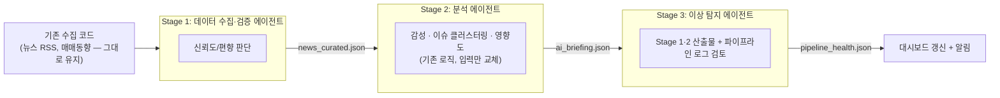

# AssetPilot 멀티 에이전트 파이프라인 설계 (초안)

> 상태: 설계 중. 아직 구현되지 않았다. 지금 실제로 도는 파이프라인은 [PIPELINE.md](PIPELINE.md) 참고 —
> 이 문서는 그걸 여러 역할로 쪼개서 고도화하는 다음 단계의 러프한 설계다. 각 에이전트는
> 별도 세션에서 하나씩 프롬프트를 튜닝해가며 구현할 예정이라, 여기서는 "무엇을/왜/어떤
> 입출력으로"까지만 정하고 "정확히 어떤 문구로 판단시킬지"는 각 에이전트 작업 세션에서 정한다.

## 배경

지금(`PIPELINE.md` A경로)은 데이터 수집(코드) → 분석(Claude, 헤드리스 `claude -p` 1회 호출) →
대시보드/알림이 하나의 스크립트(`run_briefing.sh`)에서 순서대로 도는 구조다. 이번 설계는 이 중
"분석" 부분을 역할별로 쪼개고, 지금 없는 두 가지 판단 — **뉴스 신뢰도 검증**과 **이상 탐지** —
를 새로 추가하는 것이다.

## 설계 원칙

1. **판단이 필요한 일만 에이전트(Claude)가 한다.** 재시도/백오프, RSS 파싱, DB 저장처럼 결정론적인
   작업은 지금처럼 그냥 코드로 남는다 — 에이전트로 감싸지 않는다.
2. **각 에이전트는 좁게 스코프된 권한으로 헤드리스 실행된다.** 지금 `run_briefing.sh`가
   `--settings`로 `Edit(data/ai_briefing.json)` 딱 하나만 허용하는 것과 같은 패턴을 모든 단계에
   적용한다 — 각 에이전트는 자기 출력 파일 하나만 쓸 수 있다.
3. **단계 간 인터페이스는 파일(JSON)이다.** 이전 단계의 출력을 다음 단계가 읽는 방식 — 지금
   `briefing_input.json` → `ai_briefing.json` 흐름과 동일한 패턴을 한 단계 더 늘리는 것뿐이다.
4. **외부 알고리즘/레포를 그대로 가져오지 않는다.** (분석 에이전트 설계에서 상세)

## 파이프라인 개요 (목표 상태)

## Stage 1 — 데이터 수집·검증 에이전트

**하지 않는 일**: RSS 호출, 종목 매핑, 매매동향 API 호출 — 전부 지금 코드(`news/`, `analysis/market_flow.py`) 그대로 둔다.

**하는 일**: `briefing_input.json`에 이미 모여있는 원문 뉴스 목록을 읽고, 기사별로 신뢰도를 판단한다.

- 판단 기준(초안, Stage 1 세션에서 구체화):
  - 같은 사실을 다루는 기사가 여러 독립 출처에 있는지 (교차 확인)
  - 출처가 알려진 언론사인지, 처음 보는/신뢰도 낮은 사이트인지
  - 단정적 클릭베이트 제목(과장된 수치, 자극적 어휘)인지
  - 최근 편향 신호 — 특정 소스가 유독 한쪽으로 쏠린 논조만 내는지
- **입력**: `data/briefing_input.json`
- **출력**: `data/news_curated.json` — 원문 뉴스 목록 + 기사별 `credibility: "confirmed"|"single_source"|"low_quality"` 태그, 저신뢰 기사는 제외 또는 표시만(제외 시 분석 단계가 놓치는 걸 방지하려면 "표시만" 쪽이 안전 — Stage 1 세션에서 결정)
- **권한**: `Read(data/briefing_input.json)`, `Edit(data/news_curated.json)`만

## Stage 2 — 분석 에이전트

지금 `run_briefing.sh`의 분석 프롬프트와 거의 동일 — **입력만 `briefing_input.json`(원문) 대신
`news_curated.json`(검증된 뉴스)으로 바뀐다.** 감성/이슈 클러스터링/영향도 스키마(`ai_briefing.py`의
`HoldingBriefing`/`KeyPoint`)는 그대로 유지.

- "실제 GitHub 주식분석 코드 기반으로" 아이디어에 대한 메모: 외부 레포의 특정 지표/알고리즘을
  그대로 이식하는 건 추천하지 않는다 — 이 프로젝트가 지금까지 지켜온 "AI 판단은 Claude가 직접
  해석, 알고리즘 새로 안 짬" 원칙과 충돌하고 유지보수 부담도 생긴다. 대신 이미 API로 뽑을 수 있는
  캔들/이동평균 같은 가벼운 지표를 Claude가 직접 해석하는 쪽으로 갈 것 — 필요하면 Stage 2 세션에서
  "어떤 지표를 프롬프트에 추가로 넣을지"만 논의
- **입력**: `data/news_curated.json`, 매매동향(`market_flow`)
- **출력**: `data/ai_briefing.json` (기존 스키마 유지)
- **권한**: `Read(data/news_curated.json)`, `Edit(data/ai_briefing.json)`만

## Stage 3 — 이상 탐지 에이전트

이름을 "오류 탐지"에서 "이상 탐지/모니터링"으로 좁혔다 — 재시도/네트워크 오류 처리는 이미 코드가
하고 있어서(`toss_client._get`, `fetch_google_news` 재시도, `assetpilot.log`) 이 에이전트가 다시 할
일이 아니다. 이 에이전트는 **Stage 1·2의 산출물과 숫자 데이터를 검토해서, 코드로는 못 잡는
이상 징후를 판단**한다.

- 볼 것(초안):
  - 스냅샷 시계열(`portfolio_snapshots`)에서 뉴스로 설명 안 되는 비정상적 평가금액 변동
  - `ai_briefing.json`이 여러 회차 연속으로 거의 동일한 문구를 반복하는지 (분석이 겉도는 신호)
  - Stage 1이 이번 회차에 유독 적은 뉴스/편중된 출처만 통과시켰는지 (수집 자체가 막혔을 가능성)
  - `data/assetpilot.log`의 재시도/에러 빈도가 평소보다 튀는지
- **입력**: 최근 N회 스냅샷/브리핑 히스토리, `data/assetpilot.log`
  - **열린 질문**: 지금 `ai_briefing.json`은 매번 덮어써서 이력이 안 남는다. 이상 탐지가 "반복
    여부"를 판단하려면 최소한의 이력 보관이 필요 — 방식(SQLite 테이블 추가 vs 타임스탬프
    파일 diff)은 Stage 3 세션에서 결정
- **출력**: `data/pipeline_health.json` — 발견한 이상 징후 목록 + 심각도
- **권한**: `Read`만 여러 개(로그/이력), `Edit(data/pipeline_health.json)`만
- 심각한 이상이 있으면 일반 브리핑 알림과 분리된 별도 알림(예: 다른 제목/사운드)을 보낼지도 열린 질문

## 실행 방식

`run_briefing.sh`가 헤드리스 `claude -p`를 3번 순차 호출하는 구조로 바뀐다(각 호출마다 위에서
정의한 좁은 권한을 `--settings`로 개별 전달). 지금처럼 한 번의 실패가 전체를 막지 않도록, 각
단계 실패 시 다음 단계로 넘어갈지/중단할지도 구현 시 정할 것.

## 작업 순서 제안

1. Stage 1(데이터 수집·검증) — 가장 새로운 판단이 필요한 영역이라 먼저 튜닝
2. Stage 2(분석) — 기존 로직 재사용이 많아 상대적으로 빠름, 입력만 교체
3. Stage 3(이상 탐지) — 1·2가 먼저 있어야 뭘 감시할지 정할 수 있어서 마지막
4. 파이프라인 통합(`run_briefing.sh` 재구성) + launchd 재검증

## 열린 질문 모음 (각 세션에서 결정)

- Stage 1: 저신뢰 기사를 제외할지 표시만 할지
- Stage 2: 캔들/이동평균 등 추가 지표를 프롬프트에 넣을지
- Stage 3: 브리핑 이력을 어떻게 보관할지, 이상 발견 시 알림을 어떻게 분리할지
- 3단계 각각 claude -p 호출이 늘어나면 Claude Pro 사용량이 지금(하루 5회)보다 더 느는데, 얼마나 늘지 가늠 후 장중 빈도 재조정 필요할 수 있음
