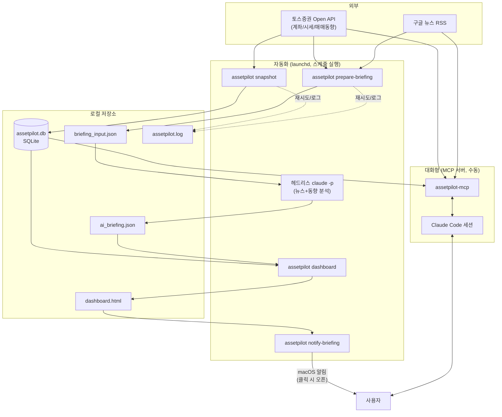

# AssetPilot 파이프라인

이 문서는 "지금 이 시스템이 실제로 어떻게 돌아가는지"를 데이터 흐름 중심으로 설명한다.
왜 이렇게 만들었는지의 히스토리는 [HISTORY.md](HISTORY.md), 앞으로 할 일은 [PLAN.md](PLAN.md),
명령어 사용법은 [README.md](README.md) 참고.

## 한눈에 보는 전체 그림

시스템은 완전히 분리된 두 갈래로 돈다: **(A) launchd가 스케줄대로 알아서 도는 자동화 파이프라인**과
**(B) Claude Code 세션에서 대화하며 쓰는 MCP 조회 도구**. 코드 모듈(`toss_client`, `storage`, `news`,
`analysis`)은 두 경로가 공유하지만, 실행되는 시점과 방식은 완전히 다르다.

## A. 자동화 파이프라인 (launchd)

macOS 로그인 세션이 켜져 있는 동안, 정해진 시각마다 아래 두 launchd 작업이 독립적으로 실행된다.
(잠들어 있거나 꺼져 있으면 그 시각은 스킵되고, 나중에 몰아서 실행되지 않는다.)

| 작업 | 스케줄 | 하는 일 | Claude 사용량 |
|---|---|---|---|
| `com.assetpilot.snapshot` | 07:00, 09:00~15:00(1시간마다), 16:00 — 하루 9회 | 보유 종목 스냅샷을 SQLite에 기록 | 없음 (토스 API만 호출) |
| `com.assetpilot.briefing` | 07:00, 09:00/12:00/15:00, 16:00 — 하루 5회 | 뉴스+매매동향 수집 → AI 분석 → 대시보드 갱신 → 알림 | 있음 (헤드리스 `claude -p`) |

### 1단계 — 스냅샷 (`assetpilot snapshot`)

1. `TossClient`가 OAuth2 Client Credentials로 토큰을 발급받는다(만료 60초 전 자동 갱신, 실패 시 재시도).
2. 계좌 조회 → 보유 종목(`get_holdings`) → 통화별 환율(`get_exchange_rate`)을 호출한다.
3. 종목별 평가금액/손익을 원화로 환산해 SQLite `portfolio_snapshots` 테이블에 한 행씩 저장한다.
4. 이렇게 쌓인 시계열 데이터가 `assetpilot report`(기간별 변화)와 `assetpilot dashboard`의 히스토리 차트 기반이 된다.

### 2단계 — 브리핑 데이터 수집 (`assetpilot prepare-briefing`)

1. 보유 종목별로 구글 뉴스 RSS에서 최근 기사(제목/출처/발행일)를 모은다 — 해외 종목은 토스 종목정보 API로 영문 정식명을 붙여 검색 정확도를 높인다.
2. 종목과 무관한 일반 시황(코스피/코스닥/증시/금리) 뉴스도 별도로 모은다(`related_symbols='MARKET'`로 구분).
3. 국내 종목은 투자자별(개인/외국인/기관) 매매동향, 공매도, 매수유의 데이터도 같이 모은다(해외 종목은 토스 API 자체가 미지원).
4. 이 원자재 데이터를 `data/briefing_input.json`에 그대로 저장한다 — **AI 판단은 여기서 하지 않는다.**

### 3단계 — AI 분석 (헤드리스 `claude -p`)

`scripts/launchd/run_briefing.sh`가 `briefing_input.json`을 읽으라는 프롬프트로 `claude -p`를 호출한다.
이 프로젝트는 처음부터 "감성분석/클러스터링 같은 AI 판단은 알고리즘을 새로 짜지 않고 Claude가 직접
데이터를 읽고 해석한다"는 원칙을 쓴다. AssetPilot 코드 자체는 Anthropic API를 한 번도 직접 호출하지
않는다 — 로컬 `claude` CLI 로그인(Claude Pro 구독)을 그대로 쓰는 방식이라 별도 API 빌링이 필요 없다.

Claude가 하는 일:
- 종목별 뉴스를 **같은 사안을 다루는 기사끼리 하나의 이슈로 묶어서** 정리 (개별 기사 나열이 아님)
- 이슈별로 시장 영향도를 `high`/`medium`/`low`로 판단
- 뉴스 논조 + 매매동향을 종합해 종목별 감성(`positive`/`neutral`/`negative`) 판단
- 시황 뉴스 + 포트폴리오 상황을 종합한 전체 총평 작성
- 결과를 정해진 JSON 스키마로 `data/ai_briefing.json`에 저장

이 실행 하나에는 `--permission-mode dontAsk --settings '{...}'`로 `data/ai_briefing.json` 쓰기 권한만
직접 부여된다 — 그 외 파일 접근이나 Bash 실행 권한은 없다.

### 4단계 — 대시보드 재생성 (`assetpilot dashboard --no-open`)

최신 스냅샷(SQLite) + 방금 만든 `ai_briefing.json`을 합쳐 `data/dashboard.html`을 다시 렌더링한다.
항상 같은 경로에 쓰기 때문에 브라우저 즐겨찾기 하나로 계속 최신 상태를 볼 수 있다.

### 5단계 — 알림 (`assetpilot notify-briefing`)

`ai_briefing.json`의 총평을 macOS 알림으로 띄운다. `terminal-notifier`(Homebrew)가 설치되어 있으면
클릭 시 방금 재생성한 `dashboard.html`이 바로 열리고, 없으면 클릭 액션 없는 기본 알림으로 대체된다.

## B. 대화형 MCP 조회

launchd 자동화와 별개로, 이 프로젝트 디렉토리에서 Claude Code를 실행하면 `assetpilot-mcp`가
`.mcp.json`을 통해 자동 연결된다(세션 재시작 필요). 실시간 조회 전용이며, 자동화 파이프라인이
만들어둔 데이터(SQLite, 뉴스 DB)와 토스 API를 그 자리에서 직접 호출한다.

| 도구 | 하는 일 |
|---|---|
| `get_accounts` / `get_holdings` / `get_quote` | 계좌·보유종목·시세 실시간 조회 |
| `get_allocation` | 원화 환산 비중, 집중도 경고 |
| `get_asset_history` | 저장된 스냅샷 기반 기간별 변화 |
| `get_market_flow` | 국내 종목 매매동향/공매도 (국내 전용) |
| `collect_news` / `get_news` | 뉴스 수동 수집 / 조회 (원문만, AI 분석은 대화 중 직접) |

예: "최근 뉴스 훑어보고 삼성전자 관련 이슈 요약해줘" — 이런 요청은 자동 브리핑을 거치지 않고
이 세션이 그 자리에서 `get_news`로 읽어와 바로 답한다.

## 데이터 저장소

| 위치 | 내용 | 누가 씀 |
|---|---|---|
| `data/assetpilot.db` (SQLite) | `portfolio_snapshots`(스냅샷 시계열), `news_items`(수집된 뉴스) | 스냅샷/뉴스 수집 단계 |
| `data/briefing_input.json` | AI 분석 전 원자재 데이터 (뉴스+매매동향) | `prepare-briefing` → `claude -p`가 읽음 |
| `data/ai_briefing.json` | AI 분석 결과 (감성/이슈/영향도/총평) | `claude -p` → 대시보드가 읽음 |
| `data/dashboard.html` | 렌더링된 대시보드 | `assetpilot dashboard` |
| `data/assetpilot.log` | 타임스탬프 포함 구조화 로그 (재시도, 에러) | 모든 CLI/MCP 실행 |
| `data/snapshot.log`, `data/briefing.log` (+`.error.log`) | launchd가 남기는 각 작업의 stdout/stderr 원본 | launchd |

## 안정성

- 토스 API 호출(`toss_client._get`)과 토큰 발급(`TossAuth._fetch_token`), 구글 뉴스 RSS 호출 모두
  일시적 오류(429/5xx, 타임아웃)에 최대 2~3회 재시도(지수 백오프)한다.
- 장중(당일 미확정) 매매동향처럼 일부 필드가 `null`로 오는 응답은 죽지 않고 건너뛴다.
- 처리되지 않은 예외는 `sys.excepthook`으로 타임스탬프와 함께 `data/assetpilot.log`에 자동 기록된다.
- `pytest`(`tests/`, 11개)가 재시도 경로와 알려진 실패 케이스(널 필드 등)를 실제 네트워크 없이(`httpx.MockTransport`/`monkeypatch`) 검증한다.

## 범위와 한계

- **조회·분석 전용이다.** 매매 실행(주문 생성/취소) 기능은 코드에 없다 — Phase 7(자동매매)에서 별도로 설계할 예정이며 아직 착수하지 않았다.
- 투자자별 매매동향/공매도 등은 국내(KR) 종목 전용이다. 해외 종목은 토스 API가 아예 지원하지 않는다(`unsupported-market`).
- 시크릿(`TOSS_CLIENT_ID`/`SECRET`, `ANTHROPIC_API_KEY`)은 `.env`에만 있고 커밋되지 않는다. MCP 서버 프로세스가 `.env`를 직접 로드하는 방식이라 별도 격리는 없다(로컬 1인 개발 환경 기준으로는 위험이 낮다고 판단해 보류 중).
